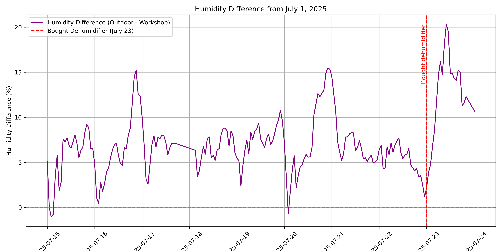

# Jupyter Notebook for Analysing my Home Assistant Sensors
[![CC BY 4.0][cc-by-shield]][cc-by-sa]

 

## License
All work under this collection is licensed under a
[Creative Commons Attribution-ShareAlike 4.0 International License][cc-by-sa], unless noted otherwise.

[cc-by-sa]: http://creativecommons.org/licenses/by-sa/4.0/
[cc-by-shield]: https://img.shields.io/badge/License-CC%20BY%20BY%20SA%204.0-lightgrey.svg
